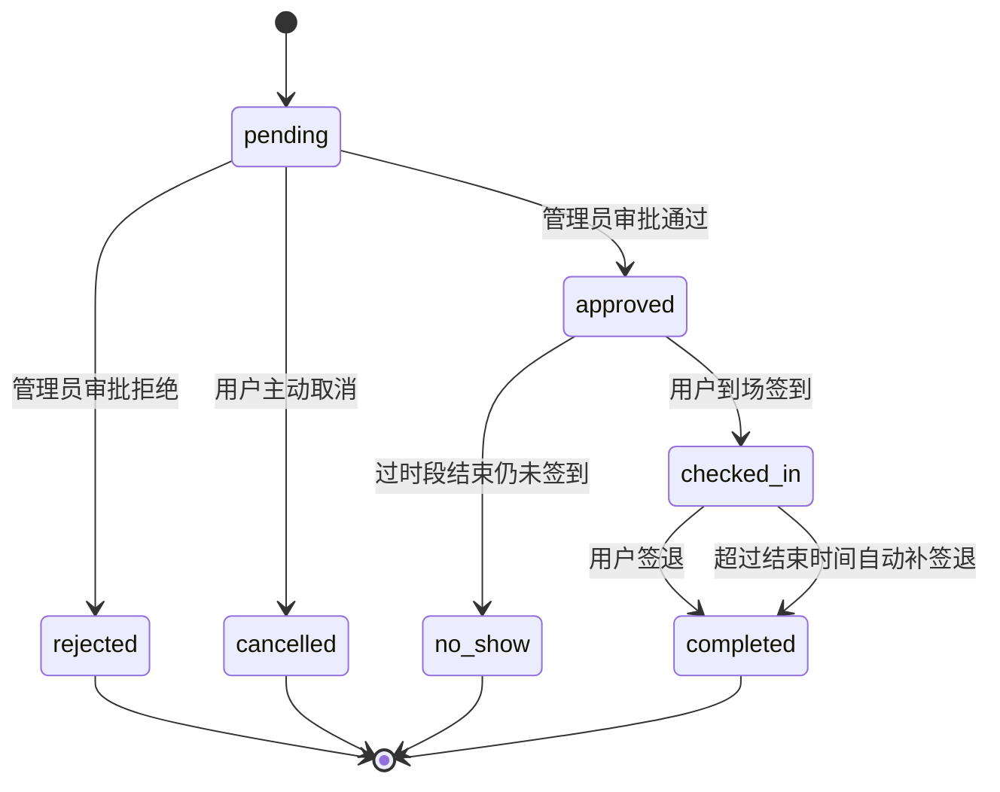

# 实验室预约签到与真实使用率方案

## 1. 目标

将“管理员统计实验室真正使用率”作为实验室模块的亮点能力，在现有“预约申请 + 管理员审批”基础上，引入：

- 预约人到达实验室后的签到
- 使用结束后的签退
- 爽约识别
- 管理员按时间范围查看实验室真实使用统计

本方案要求：

- 基于当前项目已有的 `lab_booking` 流程演进
- 不引入过重的基础设施
- 后续可以直接按本文档落地改代码

## 2. 现状与问题

### 2.1 当前能力

当前实验室模块已经支持：

- 实验室查询与筛选
- 学生/教师发起预约
- 管理员审批预约
- 用户查看自己的预约

相关实现位置：

- `D:\bishe\lamp_back\src\main\java\com\lamp\entity\LabBooking.java`
- `D:\bishe\lamp_back\src\main\java\com\lamp\service\LabService.java`
- `D:\bishe\lamp_back\src\main\java\com\lamp\controller\LabController.java`
- `D:\bishe\lamp_front\src\views\lab\MyBookingsView.vue`
- `D:\bishe\lamp_front\src\views\lab\LabApproveView.vue`

### 2.2 当前缺口

目前 `lab_booking` 只有预约层面的信息：

- `lab_id`
- `user_id`
- `date`
- `slot`
- `purpose`
- `status`

但没有记录：

- 是否真实到场
- 何时到场
- 何时离场
- 是否爽约

因此管理员当前最多只能统计：

- 待审批预约数
- 已通过预约数

不能统计：

- 实验室真实到场率
- 爽约率
- 某实验室在某时间段内的真实使用率

## 3. 设计原则

### 3.1 复用现有 `lab_booking`

不新增独立“实验室使用记录表”，而是在现有 `lab_booking` 上扩展签到/签退字段与状态。

原因：

- 当前实验室使用行为与预约单是一一对应关系
- 扩展成本低
- 便于复用现有“我的预约”“预约审批”页面

### 3.2 真实使用率采用“已生效预约”为分母

本次亮点统计不采用“总理论时段数”作为分母，而采用“已生效预约数”作为分母，定义如下：

- 已生效预约数 = 状态属于 `approved / checked_in / completed / no_show` 的预约数
- 实际使用数 = 状态属于 `checked_in / completed` 的预约数
- 真实使用率 = 实际使用数 / 已生效预约数

这样做的原因：

1. 当前系统没有“实验室历史可用时段快照”，无法准确还原“理论总可用时段”
2. 用已生效预约作为分母，最符合“预约后到底有没有真正使用”的业务含义
3. 实现简单、可解释性强，适合作为毕业设计亮点指标

### 3.3 不依赖定时任务，采用“懒刷新”策略

为降低实现复杂度，本次不强依赖 `@Scheduled` 定时任务，而采用服务层“懒刷新”策略：

- 查询我的预约时，自动刷新过期预约状态
- 查询管理员统计页时，自动刷新过期预约状态

具体规则：

- 已通过但到时段结束仍未签到 -> 自动标记为 `no_show`
- 已签到但到时段结束仍未签退 -> 自动补全为 `completed`，并把 `check_out_time` 补成时段结束时间

这样既能保证统计准确，又不需要额外引入调度复杂度。

## 4. 数据库设计

## 4.1 表结构调整

在 `lab_booking` 上新增字段：

| 字段 | 类型 | 说明 |
|------|------|------|
| `check_in_time` | DATETIME | 预约人到场签到时间 |
| `check_out_time` | DATETIME | 预约人离场签退时间 |

建议 SQL：

```sql
ALTER TABLE lab_booking
ADD COLUMN check_in_time DATETIME DEFAULT NULL COMMENT '实验室签到时间' AFTER approve_remark,
ADD COLUMN check_out_time DATETIME DEFAULT NULL COMMENT '实验室签退时间' AFTER check_in_time;

ALTER TABLE lab_booking
ADD KEY idx_status_date (status, date),
ADD KEY idx_lab_date_status (lab_id, date, status);
```

### 4.2 状态定义调整

当前状态：

- `pending`
- `approved`
- `rejected`
- `used`
- `cancelled`

建议改为：

- `pending`：待审批
- `approved`：已审批，待到场签到
- `checked_in`：已签到，正在使用
- `completed`：已签退，使用完成
- `no_show`：已审批但未到场签到，爽约
- `rejected`：已拒绝
- `cancelled`：已取消

说明：

- 原来的 `used` 建议统一替换为 `completed`
- 后续前后端都基于新状态流转

如历史数据中已存在 `used`，建议执行一次迁移：

```sql
UPDATE lab_booking
SET status = 'completed'
WHERE status = 'used';
```

## 5. 核心业务流程



## 6. 业务规则设计

### 6.1 签到规则

仅满足以下条件时允许签到：

1. 当前用户是该预约的创建人
2. 预约状态为 `approved`
3. 当前日期等于预约日期
4. 当前时间进入签到窗口

建议签到窗口：

- 时段开始前 15 分钟
- 到时段结束前均可签到

例如预约时段为 `14:00-16:00`，则：

- `13:45` 起可签到
- `16:00` 后不允许首次签到

### 6.2 签退规则

仅满足以下条件时允许签退：

1. 当前用户是该预约的创建人
2. 预约状态为 `checked_in`
3. 已经存在 `check_in_time`

签退时间规则：

- 允许在签到后任意时点签退
- 若用户一直未签退，系统在状态刷新时自动补为 `completed`
- 自动补签退时间取“预约时段结束时间”

### 6.3 爽约规则

若满足以下条件：

1. 状态仍为 `approved`
2. 当前时间已经晚于该预约时段结束时间
3. `check_in_time` 仍为空

则自动转为：

- `no_show`

### 6.4 自动完结规则

若满足以下条件：

1. 状态为 `checked_in`
2. 当前时间已经晚于预约时段结束时间
3. `check_out_time` 为空

则自动处理为：

- 状态改为 `completed`
- `check_out_time` 自动补为时段结束时间

## 7. 后端实现方案

### 7.1 实体调整

更新 `LabBooking`：

- 新增 `checkInTime`
- 新增 `checkOutTime`
- 更新状态注释为新状态枚举

对应文件：

- `D:\bishe\lamp_back\src\main\java\com\lamp\entity\LabBooking.java`

### 7.2 Repository 调整

建议在 `LabBookingRepository` 增加以下能力：

1. 按用户查询预约列表时支持新状态
2. 查询管理员统计所需的时间范围数据
3. 根据状态统计数量
4. 按实验室 + 日期范围聚合明细

建议增加的方法方向：

- `findByDateBetween(...)`
- `findByLabIdAndDateBetween(...)`
- `countByStatus(...)`
- `countByStatusInAndDateBetween(...)`

### 7.3 Service 核心改造

在 `LabService` 新增以下能力：

#### 1. 预约签到

建议新增方法：

```java
public LabBooking checkInBooking(Long bookingId, Long userId)
```

主要逻辑：

- 查预约
- 校验是否本人
- 校验状态必须为 `approved`
- 校验日期必须为今天
- 校验当前时间在签到窗口内
- 写入 `checkInTime = now`
- 状态改为 `checked_in`

#### 2. 预约签退

建议新增方法：

```java
public LabBooking checkOutBooking(Long bookingId, Long userId)
```

主要逻辑：

- 查预约
- 校验是否本人
- 校验状态必须为 `checked_in`
- 校验已存在 `checkInTime`
- 写入 `checkOutTime = now`
- 状态改为 `completed`

#### 3. 状态懒刷新

建议新增内部方法：

```java
private void refreshUsageStatus(LabBooking booking, LocalDateTime now)
```

以及批量刷新方法：

```java
public void refreshExpiredBookings()
```

处理逻辑：

- `approved` 且过了时段结束仍未签到 -> `no_show`
- `checked_in` 且过了时段结束仍未签退 -> `completed + checkOutTime=slotEndTime`

建议在以下入口调用：

- `getMyBookings()`
- `getUsageStats()`
- 管理员查看实验室使用明细页

#### 4. 统计服务

建议新增：

```java
public Map<String, Object> getUsageStats(LocalDate startDate, LocalDate endDate, Long labId)
```

返回内容建议包含：

- 总预约数
- 待审批数
- 已生效预约数
- 实际使用数
- 爽约数
- 真实使用率
- 各实验室统计列表

### 7.4 时间解析实现

当前预约时段格式固定为：

- `08:00-10:00`
- `10:00-12:00`
- `14:00-16:00`
- `16:00-18:00`
- `18:00-20:00`
- `20:00-22:00`

建议在 `LabService` 增加工具方法：

```java
private LocalDateTime getSlotStartDateTime(LabBooking booking)
private LocalDateTime getSlotEndDateTime(LabBooking booking)
```

实现方式：

- 按 `-` 拆分 `slot`
- 用 `LocalTime.parse(...)`
- 再与 `booking.getDate()` 组合为 `LocalDateTime`

这样后续签到窗口、爽约判定、自动完结都可以统一复用。

### 7.5 Controller / API 设计

建议新增接口：

#### 用户端

```http
PUT /lab/booking/{id}/check-in
PUT /lab/booking/{id}/check-out
```

权限：

- `student`
- `teacher`

且必须是预约本人。

#### 管理员统计

```http
GET /lab/usage/stats?startDate=2026-04-01&endDate=2026-04-30&labId=1
```

返回建议：

```json
{
  "overview": {
    "effectiveBookingCount": 20,
    "actualUsageCount": 15,
    "noShowCount": 5,
    "usageRate": 75.0
  },
  "list": [
    {
      "labId": 1,
      "labName": "智能感知实验室",
      "effectiveBookingCount": 8,
      "actualUsageCount": 6,
      "noShowCount": 2,
      "usageRate": 75.0
    }
  ]
}
```

### 7.6 返回字段调整

`bookingToMap(...)` 建议新增返回：

- `checkInTime`
- `checkOutTime`
- `canCheckIn`
- `canCheckOut`
- `rawStatus`

说明：

- `status` 继续返回中文显示值给前端表格展示
- `rawStatus` 便于前端做按钮判断

## 8. 前端实现方案

### 8.1 我的预约页

文件：

- `D:\bishe\lamp_front\src\views\lab\MyBookingsView.vue`

建议新增展示字段：

- 到场签到时间
- 离场签退时间

操作列根据状态动态显示：

- `待审批` -> 取消
- `已通过` 且 `canCheckIn=true` -> 签到
- `使用中` -> 签退

操作按钮建议：

- `签到`
- `签退`

### 8.2 前端 API

文件：

- `D:\bishe\lamp_front\src\api\lab.js`

建议新增：

```js
export function checkInBooking(id) { ... }
export function checkOutBooking(id) { ... }
export function getLabUsageStats(params) { ... }
```

### 8.3 管理员新增“实验室真实使用率”页面

建议新增页面：

- `D:\bishe\lamp_front\src\views\lab\LabUsageStatsView.vue`

建议路由：

- `/lab/usage-stats`

建议仅 `admin` 可访问。

页面内容建议分两部分：

#### 1. 概览卡片

- 已生效预约数
- 实际使用数
- 爽约数
- 真实使用率

#### 2. 实验室统计表

字段建议：

- 实验室编号
- 实验室名称
- 位置
- 已生效预约数
- 实际使用数
- 爽约数
- 真实使用率

筛选条件建议：

- 开始日期
- 结束日期
- 实验室

### 8.4 管理员工作台入口

建议在管理员工作台增加一个实验室使用统计入口。

当前管理员快捷入口只有：

- `课表管理`
- `考勤总览`

建议新增：

- `实验室使用统计`

同时可以考虑将管理员工作台的一个卡片替换为：

- `本月实验室真实使用率`

## 9. 统计口径定义

### 9.1 已生效预约数

状态属于以下之一：

- `approved`
- `checked_in`
- `completed`
- `no_show`

说明：

- `pending`、`rejected`、`cancelled` 不计入

### 9.2 实际使用数

状态属于以下之一：

- `checked_in`
- `completed`

说明：

- 只要真实到场签到，就认为已经实际使用
- 当前仍在使用中的预约也计入

### 9.3 爽约数

状态为：

- `no_show`

### 9.4 真实使用率

公式：

```text
真实使用率 = 实际使用数 / 已生效预约数 * 100%
```

例如：

- 已生效预约 20 次
- 其中 15 次真实签到

则：

```text
真实使用率 = 15 / 20 = 75%
```

## 10. 与当前系统的兼容策略

### 10.1 审批页保持不变

当前 `预约审批` 页只处理 `pending` 状态的预约，这一逻辑可以保留不变。

### 10.2 实验室是否可预约判断要更新

当前占用判断只排除了：

- `pending`
- `approved`

后续建议更新为排除：

- `pending`
- `approved`
- `checked_in`
- `completed`
- `no_show`

原因：

- 同一个实验室同一天同一时段，一旦产生预约记录，无论后续是否签到，都应视为该时段已被占用过

### 10.3 历史 `used` 状态兼容

如果现有数据中已经出现 `used`，统一迁移为 `completed` 后再继续新逻辑。

## 11. 实施边界与取舍

### 11.1 本次必须实现

1. 扩展 `lab_booking` 字段
2. 扩展实验室预约状态流转
3. 用户签到/签退
4. 爽约识别
5. 管理员查看真实使用率统计

### 11.2 本次不做

以下功能不纳入本轮实现：

- 二维码签到
- 地理围栏 / 实验室定位校验
- 管理员代签
- 复杂迟到、超时、违规使用处罚逻辑
- 理论总时段利用率模型

原因：

- 这些功能会显著提高实现复杂度
- 对当前“真实使用率亮点”并非必要

## 12. 分阶段实施建议

### 第一阶段：数据库与状态流转

- `lab_booking` 增加签到/签退字段
- 实体、状态映射、Repository 调整
- Service 增加签到/签退/懒刷新逻辑

### 第二阶段：用户侧预约履约

- 我的预约页增加签到/签退按钮
- 展示签到时间、签退时间
- 已通过预约支持到场签到

### 第三阶段：管理员真实使用率统计

- 后端统计接口
- 管理员统计页面
- 工作台入口和卡片优化

## 13. 最终结论

本方案采用“**在现有预约单上增加履约行为**”的方式实现实验室真实使用率统计，特点是：

- 不推翻现有实验室预约模块
- 后端状态流转清晰
- 前端交互简单直观
- 管理员统计结果可解释
- 不依赖复杂调度系统，适合当前项目规模

落地后的实验室模块将形成完整闭环：

```text
预约申请 -> 管理员审批 -> 到场签到 -> 离场签退 -> 管理员统计真实使用率
```

这比单纯的“实验室预约系统”更完整，也更适合作为系统亮点进行展示。
